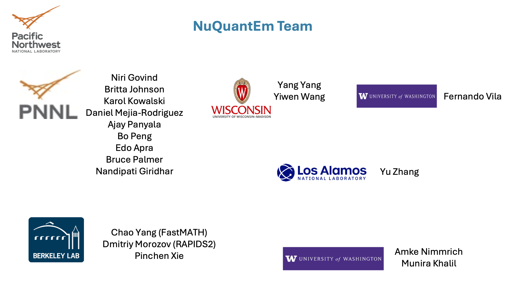

Our project brings together researchers in theoretical chemistry, quantum dynamics, applied mathematics, high-performance computing, and machine learning to build accurate, scalable tools to enable predictive insight into quantum-driven phenomena across chemistry and materials science.

<!--  -->

	
	

		<h3><u>Pacific Northwest National Laboratory</u></h3>
		<ul>
			<li><strong>Niri Govind (PI)</strong></li>
			<li><strong>Britta Johnson</strong></li>
			<li><strong>Karol Kowalski</strong></li>
            <li><strong>Daniel Mejia-Rodriguez</strong></li>
            <li><strong>Ajay Panyala</strong></li>
            <li><strong>Bo Peng</strong></li>
            <li><strong>Edo Apra</strong></li>
            <li><strong>Bruce Palmer</strong></li>
            <li><strong>Giridhar Nandipati</strong></li>
		</ul>
	

    
	

		<h3><u>Lawrence Berkeley National Laboratory</u></h3>
		<ul>
			<li><strong>Chao Yang (FastMATH)</strong></li>
			<li><strong>Dmitriy Morozov (RAPIDS2)</strong></li>
            <li><strong>Pinchen Xie</strong></li>
		</ul>
	

	
	

		<h3><u>University of Wisconsin-Madison</u></h3>
		<ul>
			<li><strong>Yang Yang</strong></li>
			<li><strong>Yiwen Wang</strong></li>
		</ul>
	

	
	

		<h3><u>University of Washington</u></h3>
		<ul>
			<li><strong>Fernando Villa</strong></li>
			<li><strong>Amke Nimmrich</strong></li>
            <li><strong>Munira Khalil</strong></li>
		</ul>
	

	
	

		<h3>Los Alamos National Laboratory</h3>
		<ul>
			<li><strong>Yu Zhang</strong></li>
		</ul>
	

